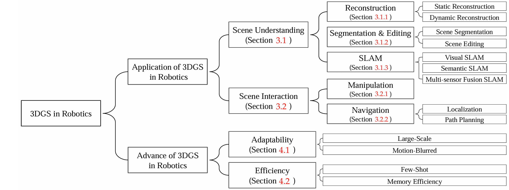

# Awesome-3D-Gaussian-Splatting-in-Robotics

    

## 🏠 Overview
  - [Application of 3DGS in Robotics](#application-of-3dgs-in-robotics)
    - Scene Understanding
      - Reconstruction
        - [Static Reconstruction](#static-reconstruction)
        - [Dynamic Reconstruction](#dynamic-reconstruction)
      - Segmentation & Editing
        - [Scene Segmentation](#scene-segmentation)
        - [Scene Editing](#scene-editing)
      - SLAM
        - [Visual SLAM](#visual-slam)
        - [Semantic SLAM](#semantic-slam)
        - [Multi-sensor Fusion SLAM](#multi-sensor-fusion-slam)
    - Scene Interaction
      - [Manipulation](#manipulation)
      - Navigation
        - [Localization](#localization)
        - [Path Planning](#path-planning)
  - [Advance of 3DGS in Robotics](#advance-of-3dgs-in-robotics)
    - Adaptability
      - [Large-Scale](#large-scale)
      - [Motion-Blurred](#motion-blurred)
    - Efficiency
      - [Few-Shot](#few-shot)
      - [RMemory Efficiency](#memory-efficiency)
  - [Datasets of Robotic Application](#datasets-of-robotic-application)

## Application of 3DGS in Robotics

### Static Reconstruction
* **360-GS**: "360-GS: Layout-guided Panoramic Gaussian Splatting For Indoor Roaming", *arXiv*. [[Paper](https://arxiv.org/abs/2402.00763.pdf)] [[Code](https://github.com/LeoDarcy/360GS)] 
* **GaussianRoom**: "GaussianRoom: Improving 3D Gaussian Splatting with SDF Guidance and Monocular Cues for Indoor Scene Reconstruction", *arXiv*. [[Paper](https://arxiv.org/abs/2405.19671.pdf)] [[Code](https://github.com/xhd0612/GaussianRoom)] 
* **IM3DG**: "Integrating Meshes and 3D Gaussians for Indoor Scene Reconstruction with SAM Mask Guidance", *arXiv*. [[Paper](https://arxiv.org/abs/2407.16173.pdf)]
* **GaussianPro**: "GaussianPro: 3D Gaussian Splatting with Progressive Propagation", *ICML 2024*. [[Paper](https://arxiv.org/abs/2402.14650.pdf)] [[Code](https://github.com/kcheng1021/GaussianPro)] [[Project Page](https://kcheng1021.github.io/gaussianpro.github.io/)] 
* **SWAG**: "SWAG: Splatting in the Wild images with Appearance-conditioned Gaussians", *ECCV 2024*. [[Paper](https://arxiv.org/abs/2403.10427.pdf)]
* **GauStudio**: "GauStudio: A Modular Framework for 3D Gaussian Splatting and Beyond", *arXiv*. [[Paper](https://arxiv.org/abs/2403.19632.pdf)] [[Code](https://github.com/GAP-LAB-CUHK-SZ/gaustudio)] 
* **HGS-Mapping**: "HGS-Mapping: Online Dense Mapping Using Hybrid Gaussian Representation in Urban Scenes", *RAL 2024*. [[Paper](https://arxiv.org/abs/2403.20159.pdf)] 
* **HO-Gaussian**: "HO-Gaussian: Hybrid Optimization of 3D Gaussian Splatting for Urban Scenes", *ECCV 2024*. [[Paper](https://arxiv.org/abs/2403.20032.pdf)] 
* **TCLC-GS**: "TCLC-GS: Tightly Coupled LiDAR-Camera Gaussian Splatting for Autonomous Driving", *ECCV 2024*. [[Paper](https://arxiv.org/abs/2404.02410.pdf)]
* **PGSR**: "PGSR: Planar-based Gaussian Splatting for Efficient and High-Fidelity Surface Reconstruction", *TVCG 2024*. [[Paper](https://arxiv.org/abs/2406.06521.pdf)] [[Code](https://github.com/zju3dv/PGSR)] 
* **Wild-GS**: "Wild-GS: Real-Time Novel View Synthesis from Unconstrained Photo Collections", *NeurIPS 2024*. [[Paper](https://arxiv.org/abs/2406.10373.pdf)] [[Code](https://github.com/XuJiacong/Wild-GS)] 
* **WildGaussians**: "WildGaussians: 3D Gaussian Splatting in the Wild", *NeurIPS 2024*. [[Paper](https://arxiv.org/abs/2407.08447.pdf)] [[Code](https://github.com/jkulhanek/wild-gaussians/)] [[Project Page](https://wild-gaussians.github.io//)] 
* **DHGS**: "DHGS: Decoupled Hybrid Gaussian Splatting for Driving Scene", *arXiv*. [[Paper](https://arxiv.org/abs/2407.16600.pdf)] [[Project Page](https://ironbrotherstyle.github.io/dhgs_web///)] 
* **ActiveSplat**: "ActiveSplat: High-Fidelity Scene Reconstruction through Active Gaussian Splatting", *arXiv*.  
  [[Paper](https://li-yuetao.github.io/ActiveSplat/ActiveSplat.pdf)] [[Project Page](https://li-yuetao.github.io/ActiveSplat/)]  

### Dynamic Reconstruction
* **PVG**: "Periodic Vibration Gaussian: Dynamic Urban Scene Reconstruction and Real-time Rendering", *arXiv*. [[Paper](https://arxiv.org/pdf/2311.18561)] [[Code](https://github.com/fudan-zvg/PVG)] [[Project Page](https://fudan-zvg.github.io/PVG/)]
* **DrivingGaussian**: "DrivingGaussian: Composite Gaussian Splatting for Surrounding Dynamic Autonomous Driving Scenes", *CVPR 2024*. [[Paper](https://arxiv.org/pdf/2312.07920)] [[Code](https://github.com/VDIGPKU/DrivingGaussian)] [[Project Page](https://pkuvdig.github.io/DrivingGaussian/)]
* **Street Gaussians**: "Street Gaussians: Modeling Dynamic Urban Scenes with Gaussian Splatting", *ECCV 2024*. [[Paper](https://arxiv.org/pdf/2401.01339)] [[Code](https://github.com/zju3dv/street_gaussians)] [[Project Page](https://zju3dv.github.io/street_gaussians/)]
* **HUGS**: "HUGS: Holistic Urban 3D Scene Understanding via Gaussian Splatting", *CVPR 2024*. [[Paper](https://arxiv.org/pdf/2403.12722)] [[Code](https://github.com/hyzhou404/HUGS)] [[Project Page](https://xdimlab.github.io/hugs_website)]
* **MoSca**: "MoSca: Dynamic Gaussian Fusion from Casual Videos via 4D Motion Scaffolds", *arXiv*. [[Paper](https://arxiv.org/pdf/2405.17421)] [[Code](https://github.com/JiahuiLei/MoSca)] [[Project Page](https://www.cis.upenn.edu/~leijh/projects/mosca)]
* **S^3Gaussian**: "S^3Gaussian: Self-Supervised Street Gaussians for Autonomous Driving", *arXiv*. [[Paper](https://arxiv.org/pdf/2405.20323)] [[Code](https://github.com/nnanhuang/S3Gaussian/)] [[Project Page](https://wzzheng.net/S3Gaussian/)]
* **4DGF**: "Dynamic 3D Gaussian Fields for Urban Areas", *ECCV 2024*. [[Paper](https://arxiv.org/pdf/2406.03175)] [[Code](https://github.com/tobiasfshr/map4d)] [[Project Page](https://tobiasfshr.github.io/pub/4dgf/)]
* **VDG**: "VDG: Vision-Only Dynamic Gaussian for Driving Simulation", *arXiv*. [[Paper](https://arxiv.org/pdf/2406.18198)] [[Project Page](https://3d-aigc.github.io/VDG)]
* **EgoGaussian**: "EgoGaussian: Dynamic Scene Understanding from Egocentric Video with 3D Gaussian Splatting", 
*3DV 2025*. [[Paper](https://arxiv.org/pdf/2406.19811)] [[Code](https://github.com/zdwww/EgoGaussian)] [[Project Page](https://zdwww.github.io/egogs.github.io/)]
* **AutoSplat**: "AutoSplat: Constrained Gaussian Splatting for Autonomous Driving Scene Reconstruction", *arXiv*. 
[[Paper](https://arxiv.org/pdf/2407.02598)] [[Project Page](https://autosplat.github.io/)]
* **Dynamic 3DG**: "Dynamic 3D Gaussians: Tracking by Persistent Dynamic View Synthesis", *3DV 2024*. 
[[Paper](https://arxiv.org/pdf/2308.09713)] [[Code](https://github.com/JonathonLuiten/Dynamic3DGaussians)] [[Project Page](https://dynamic3dgaussians.github.io/)]
* **Deformable 3DG**: "Deformable 3D Gaussians for High-Fidelity Monocular Dynamic Scene Reconstruction", *CVPR 2024*. 
[[Paper](https://arxiv.org/pdf/2309.13101)] [[Code](https://github.com/ingra14m/Deformable-3D-Gaussians)] [[Project Page](https://ingra14m.github.io/Deformable-Gaussians/)]
* **4DGaussians**: "4D Gaussian Splatting for Real-Time Dynamic Scene Rendering", *CVPR 2024*. 
[[Paper](https://arxiv.org/pdf/2310.08528)] [[Code](https://github.com/hustvl/4DGaussians)] [[Project Page](https://guanjunwu.github.io/4dgs/)]
* **P4DGS**: "Real-time Photorealistic Dynamic Scene Representation and Rendering with 4D Gaussian Splatting", *ICLR 2024*. 
[[Paper](https://arxiv.org/pdf/2310.10642)] [[Code](https://github.com/fudan-zvg/4d-gaussian-splatting)] [[Project Page](https://fudan-zvg.github.io/4d-gaussian-splatting/)]
* **Efficient 3DG**: "An Efficient 3D Gaussian Representation for Monocular/Multi-view Dynamic Scenes", *arXiv*. 
[[Paper](https://arxiv.org/pdf/2311.12897v1)] [[Code](https://github.com/raven38/EfficientDynamic3DGaussian)]
* **SC-GS**: "SC-GS: Sparse-Controlled Gaussian Splatting for Editable Dynamic Scenes", *CVPR 2024*. [[Paper](https://arxiv.org/pdf/2312.14937)] [[Code](https://github.com/yihua7/SC-GS)]
* **Gaussian-Flow**: "Gaussian-Flow: 4D Reconstruction with Dynamic 3D Gaussian Particle", *CVPR 2024*. 
[[Paper](https://arxiv.org/pdf/2312.03431)] [[Code](https://github.com/NJU-3DV/Gaussian-Flow)] [[Project Page](https://nju-3dv.github.io/projects/Gaussian-Flow)]
* **GauFRe**: "GauFRe: Gaussian Deformation Fields for Real-time Dynamic Novel View Synthesis", *arXiv*. [[Paper](https://arxiv.org/pdf/2312.11458)] [[Project Page](https://lynl7130.github.io/gaufre/index.html)]
* **SWAGS**: "SWAGS: Sampling Windows Adaptively for Dynamic 3D Gaussian Splatting", *arXiv*. [[Paper](https://arxiv.org/pdf/2312.13308v1)]
* **STG**: "Spacetime Gaussian Feature Splatting for Real-Time Dynamic View Synthesis", *CVPR 2024*. [[Paper](https://arxiv.org/pdf/2312.16812)] [[Code](https://github.com/oppo-us-research/SpacetimeGaussians)] [[Project Page](https://oppo-us-research.github.io/SpacetimeGaussians-website/)]
* **4D-Rotor**: "4D-Rotor Gaussian Splatting: Towards Efficient Novel View Synthesis for Dynamic Scenes", *SIGGRAPH 2024*. 
[[Paper](https://arxiv.org/pdf/2402.03307)] [[Code](https://github.com/weify627/4D-Rotor-Gaussians)] [[Project Page](https://weify627.github.io/4drotorgs/)]
* **3DGStream**: "3DGStream: On-the-Fly Training of 3D Gaussians for Efficient Streaming of Photo-Realistic Free-Viewpoint Videos", *CVPR 2024*. 
[[Paper](https://arxiv.org/pdf/2403.01444)] [[Code](https://github.com/SJoJoK/3DGStream)] [[Project Page](https://sjojok.github.io/3dgstream)]
* **ED3DGS**: "Per-Gaussian Embedding-Based Deformation for Deformable 3D Gaussian Splatting", *ECCV 2024*. 
[[Paper](https://arxiv.org/pdf/2404.03613)] [[Code](https://github.com/JeongminB/E-D3DGS)] [[Project Page](https://jeongminb.github.io/e-d3dgs/)]
* **GaGS**: "3D Geometry-Aware Deformable Gaussian Splatting for Dynamic View Synthesis", *CVPR 2024*. [[Paper](https://arxiv.org/pdf/2404.06270)]  [[Project Page](https://npucvr.github.io/GaGS/)]
* **R3DG**: "A Refined 3D Gaussian Representation for High-Quality Dynamic Scene Reconstruction" , *arXiv*. [[Paper](https://arxiv.org/pdf/2405.17891)] 
* **SP-GS**: "Superpoint Gaussian Splatting for Real-Time High-Fidelity Dynamic Scene Reconstruction", *ICML 2024*. 
[[Paper](https://arxiv.org/pdf/2406.03697)] [[Code](https://github.com/dnvtmf/SP_GS)] [[Project Page](https://dnvtmf.github.io/SP_GS.github.io)]
* **AmbientGaussian**: "Modeling Ambient Scene Dynamics for Free-view Synthesis", *SIGGRAPH 2024*. 
[[Paper](https://arxiv.org/pdf/2406.09395)] [[Project Page](https://ambientgaussian.github.io/)]
* **DGM**: "Dynamic Gaussian Marbles for Novel View Synthesis of Casual Monocular Videos", *SIGGRAPH Asia 2024*. 
[[Paper](https://arxiv.org/pdf/2406.18717)] [[Code](https://github.com/coltonstearns/dynamic-gaussian-marbles)] [[Project Page](https://geometry.stanford.edu/projects/dynamic-gaussian-marbles.github.io/)]
* **GS-LK**: "Gaussian Splatting LK", *arXiv*. [[Paper](https://arxiv.org/pdf/2407.11309)]
* **S4D**: "S4D: Streaming 4D Real-World Reconstruction with Gaussians and 3D Control Points", *arXiv*. [[Paper](https://arxiv.org/pdf/2408.13036)]

### Scene Segmentation
* **Gaussian Grouping**: "Gaussian Grouping: Segment and Edit Anything in 3D Scenes", *ECCV 2024*. [[Paper](https://arxiv.org/pdf/2312.00732)] [[Code](https://github.com/lkeab/gaussian-grouping)]
* **SAGA**: "Segment Any 3D Gaussians", *arXiv*. [[Paper](https://arxiv.org/abs/2312.00860)] [[Code](https://github.com/Jumpat/SegAnyGAussians)]
* **Feature 3DGS**: "Feature 3DGS: Supercharging 3D Gaussian Splatting to Enable Distilled Feature Fields", *CVPR 2024*. 
[[Paper](https://arxiv.org/pdf/2312.03203)] [[Code](https://github.com/ShijieZhou-UCLA/feature-3dgs)] [[Project Page](https://feature-3dgs.github.io/)]
* **3DG Seg**: "2D-Guided 3D Gaussian Segmentation", *arXiv*. [[Paper](https://arxiv.org/pdf/2312.16047)]
* **CoSSegGaussians**: "CoSSegGaussians: Compact and Swift Scene Segmenting 3D Gaussians with Dual Feature Fusion", *arXiv*. 
[[Paper](https://arxiv.org/abs/2401.05925v1)] [[Project Page](https://david-dou.github.io/CoSSegGaussians/)]
* **SAGD**: "SAGD: Boundary-Enhanced Segment Anything in 3D Gaussian via Gaussian Decomposition", *arXiv*. [[Paper](https://arxiv.org/pdf/2401.17857)]
* **Semantic Gaussians**: "Semantic Gaussians: Open-Vocabulary Scene Understanding with 3D Gaussian Splatting", *arXiv*. 
[[Paper](https://arxiv.org/pdf/2403.15624)] [[Code](https://github.com/sharinka0715/semantic-gaussians)] [[Project Page](https://sharinka0715.github.io/semantic-gaussians/)]
* **EgoLifter**: "EgoLifter: Open-world 3D Segmentation for Egocentric Perception", *ECCV 2024*. 
[[Paper](https://arxiv.org/pdf/2403.18118)] [[Code](https://github.com/facebookresearch/egolifter)] [[Project Page](https://egolifter.github.io/)]
* **Gaga**: "Gaga: Group Any Gaussians via 3D-aware Memory Bank", *arXiv*. 
[[Paper](https://arxiv.org/abs/2404.07977)] 
* **CGC**: "Contrastive Gaussian Clustering: Weakly Supervised 3D Scene Segmentation", *arXiv*. [[Paper](https://arxiv.org/pdf/2404.12784)]
* **CLIP-GS**: "CLIP-GS: CLIP-Informed Gaussian Splatting for Real-time and View-consistent 3D Semantic Understanding", *arXiv*. [[Paper](https://arxiv.org/pdf/2404.14249)] [[Project Page](https://gbliao.github.io/CLIP-GS.github.io/)]
* **FMGS**: "FMGS: Foundation Model Embedded 3D Gaussian Splatting for Holistic 3D Scene Understanding", *IJCV 2024*. 
[[Paper](https://arxiv.org/pdf/2401.01970)] [[Project Page](https://xingxingzuo.github.io/fmgs)]
* **RT-GS2**: "RT-GS2: Real-Time Generalizable Semantic Segmentation for 3D Gaussian Representations of Radiance Fields", *BMVC 2024*. 
[[Paper](https://arxiv.org/pdf/2405.18033)] [[Project Page](https://mbjurca.github.io/rt-gs2/)]
* **OpenGaussian**: "OpenGaussian: Towards Point-Level 3D Gaussian-based Open Vocabulary Understanding", *NeurIPS 2024*. 
[[Paper](https://arxiv.org/pdf/2406.02058)] [[Code](https://github.com/yanmin-wu/OpenGaussian)] [[Project Page](https://3d-aigc.github.io/OpenGaussian)]
* **Click-Gaussian**: "Click-Gaussian: Interactive Segmentation to Any 3D Gaussians", *ECCV 2024*. 
[[Paper](https://arxiv.org/pdf/2407.11793)] [[Project Page](https://seokhunchoi.github.io/Click-Gaussian/)]
* **SA4D**: "Segment Any 4D Gaussians", *arXiv*. [[Paper](https://arxiv.org/pdf/2407.04504)] [[Code](https://jsxzs.github.io/sa4d/)]
* **GaussianBeV**: "GaussianBeV: 3D Gaussian Representation meets Perception Models for BeV Segmentation", *arXiv*. [[Paper](https://arxiv.org/pdf/2407.14108)]
 
### Scene Editing
* **GScream**: "GScream: Learning 3D Geometry and Feature Consistent Gaussian Splatting for Object Removal", *ECCV 2024*. 
[[Paper](https://arxiv.org/abs/2404.13679)] [[Code](https://github.com/W-Ted/GScream)]
* **ReGS**: "Reference-based Controllable Scene Stylization with Gaussian Splatting", *NeurIPS 2024*. [[Paper](https://arxiv.org/abs/2407.07220)]
* **Point'n Move**: "Point'n Move: Interactive Scene Object Manipulation on Gaussian Splatting Radiance Fields", *arXiv*. [[Paper](https://arxiv.org/abs/2311.16737)] 
* "3D Gaussian Editing with A Single Image", *ACMMM 2024*. [[Paper](https://arxiv.org/abs/2408.07540)] 
* **Feature Splatting**: "Feature Splatting: Language-Driven Physics-Based Scene Synthesis and Editing", *ECCV 2024*. 
[[Paper](https://arxiv.org/abs/2404.01223)] [[Code](https://github.com/vuer-ai/feature-splatting-inria)] [[Project Page](https://feature-splatting.github.io/)]
* **Texture-GS**: "Texture-GS: Disentangling the Geometry and Texture for 3D Gaussian Splatting Editing", *ECCV 2024*. 
[[Paper](https://arxiv.org/abs/2403.10050)] [[Code](https://github.com/slothfulxtx/Texture-GS)]
* **TIP-Editor**: "TIP-Editor: An Accurate 3D Editor Following Both Text-Prompts And Image-Prompts", *TOG 2024*. 
[[Paper](https://arxiv.org/abs/2401.14828)] [[Code](https://github.com/zjy526223908/TIP-Editor)] [[Project Page](https://zjy526223908.github.io/TIP-Editor/)]
* **GSEdit**: "GSEdit: Efficient Text-Guided Editing of 3D Objects via Gaussian Splatting", *arXiv*. [[Paper](https://arxiv.org/abs/2403.05154)] 
* **GaussCtrl**: "GaussCtrl: Multi-View Consistent Text-Driven 3D Gaussian Splatting Editing", *ECCV 2024*. 
[[Paper](https://arxiv.org/abs/2403.08733)] [[Code](https://github.com/ActiveVisionLab/gaussctrl)] [[Project Page](https://gaussctrl.active.vision/)]
* "View-Consistent 3D Editing with Gaussian Splatting", *ECCV 2024*. [[Paper](https://arxiv.org/abs/2403.11868)] 
* **GaussianEditor**: "GaussianEditor: Editing 3D Gaussians Delicately with Text Instructions", *CVPR 2024*. [[Paper](https://arxiv.org/abs/2311.16037)]
* **GaussianEditor**: "GaussianEditor: Swift and Controllable 3D Editing with Gaussian Splatting", *CVPR 2024*. 
[[Paper](https://arxiv.org/abs/2311.14521)] [[Code](https://github.com/buaacyw/GaussianEditor)] [[Project Page](https://buaacyw.github.io/gaussian-editor/)]
* **DGE**: "DGE: Direct Gaussian 3D Editing by Consistent Multi-view Editing", *ECCV 2024*. 
[[Paper](https://arxiv.org/abs/2404.18929)] [[Code](https://github.com/silent-chen/DGE)] [[Project Page](https://silent-chen.github.io/DGE/)]
* **TIGER**: "TIGER: Text-Instructed 3D Gaussian Retrieval and Coherent Editing", *arXiv*. 
[[Paper](https://arxiv.org/abs/2405.14455)] [[Project Page](https://xutanxing.github.io/TIGER/)]
* **TrAME**: "TrAME: Trajectory-Anchored Multi-View Editing for Text-Guided 3D Gaussian Splatting Manipulation", *arXiv*. [[Paper](https://arxiv.org/abs/2407.02034)] 
* **3DEgo**: "3DEgo: 3D Editing on the Go!", *ECCV 2024*. 
[[Paper](https://arxiv.org/abs/2407.10102)] [[Project Page](https://3dego.github.io/)]
*  "Localized Gaussian Splatting Editing with Contextual Awareness", *WACV 2025*. [[Paper](https://arxiv.org/abs/2408.00083)]
* **StyleGaussian**: "StyleGaussian: Instant 3D Style Transfer with Gaussian Splatting", *SIGGRAPH Asia 2024*. 
[[Paper](https://arxiv.org/abs/2403.07807)] [[Code](https://github.com/Kunhao-Liu/StyleGaussian)] [[Project Page](https://kunhao-liu.github.io/StyleGaussian/)] 
* **StylizedGS**: "StylizedGS: Controllable Stylization for 3D Gaussian Splatting", *arxiv*. 
[[Paper](https://arxiv.org/abs/2404.05220)] 
* "Gaussian Splatting in Style", *arxiv*. 
[[Paper](https://arxiv.org/abs/2403.08498)] 
* **ICE-G**: "ICE-G: Image Conditional Editing of 3D Gaussian Splats", *arxiv*. 
[[Paper](https://arxiv.org/abs/2406.08488)] [[Project Page](https://ice-gaussian.github.io/)]
* **StyleSplat**: "StyleSplat: 3D Object Style Transfer with Gaussian Splatting", *arxiv*. 
[[Paper](https://arxiv.org/abs/2407.09473)] [[Code](https://github.com/bernard0047/style-splat)] [[Project Page](https://bernard0047.github.io/stylesplat/)]
* **InstantStyleGaussian**: "InstantStyleGaussian: Efficient Art Style Transfer with 3D Gaussian Splatting", *arxiv*. 
[[Paper](https://arxiv.org/abs/2408.04249)] 

### Visual SLAM
* **SplaTAM**: "SplaTAM: Splat, Track & Map 3D Gaussians for Dense RGB-D SLAM", *CVPR 2024*. 
[[Paper](https://arxiv.org/abs/2312.02126)] [[Code](https://github.com/spla-tam/SplaTAM)] [[Project Page](https://spla-tam.github.io/)]
* **Gaussian-SLAM**: "Gaussian-SLAM: Photo-realistic Dense SLAM with Gaussian Splatting", *arxiv*. 
[[Paper](https://arxiv.org/abs/2312.10070)] [[Code](https://github.com/VladimirYugay/Gaussian-SLAM)] [[Project Page](https://vladimiryugay.github.io/gaussian_slam/)]
* **NGM-SLAM**: "NGM-SLAM: Gaussian Splatting SLAM with Radiance Field Submap", *arxiv*. 
[[Paper](https://arxiv.org/abs/2405.05702)] 
* **MG-SLAM**: "Structure Gaussian SLAM with Manhattan World Hypothesis", *arxiv*. 
[[Paper](https://arxiv.org/abs/2405.20031)] 
* **HF-SLAM**: "High-Fidelity SLAM Using Gaussian Splatting with Rendering-Guided Densification and Regularized Optimization", *IROS 2024*. 
[[Paper](https://arxiv.org/abs/2403.12535)]
* **CG-SLAM**: "CG-SLAM: Efficient Dense RGB-D SLAM in a Consistent Uncertainty-aware 3D Gaussian Field", *ECCV 2024*. 
[[Paper](https://arxiv.org/abs/2403.16095)] [[Code](https://github.com/hjr37/CG-SLAM)] [[Project Page](https://zju3dv.github.io/cg-slam/)]
* **GS-SLAM**: "GS-SLAM: Dense Visual SLAM with 3D Gaussian Splatting", *CVPR 2024*. 
[[Paper](https://arxiv.org/abs/2311.11700)] [[Project Page](https://gs-slam.github.io/)]
* **GS-ICP SLAM**: "RGBD GS-ICP SLAM", *ECCV 2024*. 
[[Paper](https://arxiv.org/abs/2403.12550)] [[Code](https://github.com/Lab-of-AI-and-Robotics/GS_ICP_SLAM)]
* **TAMBRIDGE**: "TAMBRIDGE: Bridging Frame-Centered Tracking and 3D Gaussian Splatting for Enhanced SLAM", *arxiv*. 
[[Paper](https://arxiv.org/abs/2405.19614)] [[Code](https://github.com/ZeldaFromHeaven/TAMBRIDGE-DAVID)] [[Project Page](https://zeldafromheaven.github.io/TAMBRIDGE/)]
* **Compact-SLAM**: "Compact 3D Gaussian Splatting For Dense Visual SLAM", *arxiv*. 
[[Paper](https://arxiv.org/abs/2403.11247)]
* **RTG-SLAM**: "RTG-SLAM: Real-time 3D Reconstruction at Scale using Gaussian Splatting", *SIGGRAPH 2024*. 
[[Paper](https://arxiv.org/abs/2404.19706)] [[Code](https://github.com/MisEty/RTG-SLAM)] [[Project Page](https://gapszju.github.io/RTG-SLAM/)]
* "Visual SLAM with 3D Gaussian Primitives and Depth Priors Enabling Novel View Synthesis", *arxiv*. 
[[Paper](https://arxiv.org/abs/2408.05635)] 
* **I^2-SLAM**: "I^2-SLAM: Inverting Imaging Process for Robust Photorealistic Dense SLAM", *ECCV 2024*. 
[[Paper](https://arxiv.org/abs/2407.11347)]
* **LoopSplat**: "LoopSplat: Loop Closure by Registering 3D Gaussian Splats", *3DV 2025*. 
[[Paper](https://arxiv.org/abs/2408.10154)] [[Code](https://github.com/GradientSpaces/LoopSplat)] [[Project Page](https://loopsplat.github.io/)]
* **GSFusion**: "GSFusion: Online RGB-D Mapping Where Gaussian Splatting Meets TSDF Fusion", *RAL 2024*. 
[[Paper](https://arxiv.org/abs/2408.12677)] [[Code](https://github.com/smartroboticslab/GSFusion)] [[Project Page](https://gs-fusion.github.io/)]
* **MonoGS**: "Gaussian splatting slam", *CVPR 2024*. 
[[Paper](https://arxiv.org/abs/2312.06741)] [[Code](https://github.com/muskie82/MonoGS)] [[Project Page](https://rmurai.co.uk/projects/GaussianSplattingSLAM/)]
* **MotionGS**: "MotionGS: Compact Gaussian Splatting SLAM by Motion Filter", *arxiv*.
[[Paper](https://arxiv.org/abs/2405.11129)]
* **Photo-SLAM**: "Photo-SLAM: Real-time Simultaneous Localization and Photorealistic Mapping for Monocular, Stereo, and RGB-D Cameras", *CVPR 2024*.
[[Paper](https://arxiv.org/abs/2311.16728)] [[Code](https://github.com/HuajianUP/Photo-SLAM)] [[Project Page](https://huajianup.github.io/research/Photo-SLAM/)]
* **MGS-SLAM**: "MGS-SLAM: Monocular Sparse Tracking and Gaussian Mapping with Depth Smooth Regularization", *RAL 2024*.
[[Paper](https://arxiv.org/abs/2405.06241)] [[Code](https://github.com/Z-Pengcheng/MGS-SLAM)]
* **MonoG-SLAM**: "Monocular Gaussian SLAM with Language Extended Loop Closure", *arxiv*.
[[Paper](https://arxiv.org/abs/2405.13748)]
* **Splat-SLAM**: "Splat-SLAM: Globally Optimized RGB-only SLAM with 3D Gaussians", *arxiv*.
[[Paper](https://arxiv.org/abs/2405.16544)] [[Code](https://github.com/google-research/Splat-SLAM)] 
* **IG-SLAM**: "IG-SLAM: Instant Gaussian SLAM", *ECCV 2024 NeuSLAM Workshop*.
[[Paper](https://arxiv.org/abs/2408.01126)] [[Code](https://github.com/Liouvi/IG-SLAM)] 

### Semantic SLAM
* **SGS-SLAM**: "SGS-SLAM: Semantic Gaussian Splatting For Neural Dense SLAM", *ECCV 2024*.
[[Paper](https://arxiv.org/abs/2402.03246)] [[Code](https://github.com/ShuhongLL/SGS-SLAM)] 
* **SemGauss-SLAM**: "SemGauss-SLAM: Dense Semantic Gaussian Splatting SLAM", *arxiv*.
[[Paper](https://arxiv.org/abs/2403.07494)] [[Code](https://github.com/IRMVLab/SemGauss-SLAM)] 
* **NEDS-SLAM**: "NEDS-SLAM: A Neural Explicit Dense Semantic SLAM Framework using 3D Gaussian Splatting", *RAL 2024*.
[[Paper](https://arxiv.org/abs/2403.11679)]
* **GS3LAM**: "GS3LAM: Gaussian Semantic Splatting SLAM", *ACM MM 2024*.
[[Paper](https://dl.acm.org/doi/10.1145/3664647.3680739)] [[Code](https://github.com/lif314/GS3LAM)]
* **LEGS**: "Language-Embedded Gaussian Splats (LEGS): Incrementally Building Room-Scale Representations with a Mobile Robot", *IROS 2024*.
[[Paper](https://arxiv.org/abs/2409.18108)] [[Code](https://github.com/BerkeleyAutomation/L3GS)] [[Project Page](https://berkeleyautomation.github.io/LEGS/)]

### Multi-sensor Fusion SLAM
* **LIV-GaussMap**: "LIV-GaussMap: LiDAR-Inertial-Visual Fusion for Real-time 3D Radiance Field Map Rendering", *RAL 2024*.
[[Paper](https://arxiv.org/abs/2401.14857)] [[Code](https://github.com/sheng00125/LIV-GaussMap)] 
* **Gaussian-LIC**: "Gaussian-LIC: Real-Time Photo-Realistic SLAM with Gaussian Splatting and LiDAR-Inertial-Camera Fusion", *arxiv*.
[[Paper](https://arxiv.org/abs/2404.06926)] [[Code](https://github.com/APRIL-ZJU/Gaussian-LIC)]
* **MM-Gaussian**: "MM-Gaussian: 3D Gaussian-based Multi-modal Fusion for Localization and Reconstruction in Unbounded Scenes", *arxiv*.
[[Paper](https://arxiv.org/abs/2404.04026)]
* **MM3DGS-SLAM**: "MM3DGS-SLAM: Multi-modal 3D Gaussian Splatting for SLAM Using Vision, Depth, and Inertial Measurements", *IROS 2024*.
[[Paper](https://arxiv.org/pdf/2404.00923)] [[Code](https://github.com/VITA-Group/MM3DGS-SLAM)] [[Project Page](https://vita-group.github.io/MM3DGS-SLAM/)]

### Manipulation
* **GaussianGrasper**: "GaussianGrasper: 3D Language Gaussian Splatting for Open-vocabulary Robotic Grasping", *RAL 2024*.
[[Paper](https://arxiv.org/abs/2403.09637)] [[Code](https://github.com/MrSecant/GaussianGrasper)] [[Project Page](https://mrsecant.github.io/GaussianGrasper/)]
* **Splat-MOVER**: "Splat-MOVER: Multi-Stage, Open-Vocabulary Robotic Manipulation via Editable Gaussian Splatting", *CoRL 2024*.
[[Paper](https://arxiv.org/abs/2405.04378)] [[Code](https://github.com/StanfordMSL/Splat-MOVER)] [[Project Page](https://splatmover.github.io/)]
* **ManiGaussian**: "ManiGaussian: Dynamic Gaussian Splatting for Multi-task Robotic Manipulation", *ECCV 2024*.
[[Paper](https://arxiv.org/abs/2403.08321)] [[Code](https://github.com/GuanxingLu/ManiGaussian)] [[Project Page](https://guanxinglu.github.io/ManiGaussian/)]
* "Object-Aware Gaussian Splatting for Robotic Manipulation", *ICRA 2024 Workshop*.
[[Paper](https://openreview.net/pdf?id=gdRI43hDgo)] [[Project Page](https://object-aware-gaussian.github.io/)]

### Localization
* **iComMa**: "iComMa: Inverting 3D Gaussian Splatting for Camera Pose Estimation via Comparing and Matching", *arxiv*.
[[Paper](https://arxiv.org/abs/2312.09031)] [[Code](https://github.com/YuanSun-XJTU/iComMa)] 
* **COGS**: "A Construct-Optimize Approach to Sparse View Synthesis without Camera Pose", *SIGGRAPH 2024*.
[[Paper](https://arxiv.org/abs/2405.03659)] [[Code](https://github.com/RaymondJiangkw/COGS)] [[Project Page](https://raymondjiangkw.github.io/cogs.github.io/)]
* **3DGS-ReLoc**: "3DGS-ReLoc: 3D Gaussian Splatting for Map Representation and Visual ReLocalization", *arxiv*.
[[Paper](https://arxiv.org/abs/2403.11367)] 
* "Enhancing Visual Relocalization with Dense Scene Coordinates Derived from 3D Gaussian Splatting", *ICRA 2024 Workshop*.
[[Paper](https://openreview.net/pdf?id=QPJGhB1sLm)]
* **6DGS**: "6DGS: 6D Pose Estimation from a Single Image and a 3D Gaussian Splatting Model", *ECCV 2024*.
[[Paper](https://arxiv.org/abs/2407.15484)] [[Code](https://github.com/mbortolon97/6dgs)] [[Project Page](https://mbortolon97.github.io/6dgs/)]
* **CF-3DG**: "COLMAP-Free 3D Gaussian Splatting", *CVPR 2024*.
[[Paper](https://arxiv.org/abs/2312.07504)] [[Code](https://github.com/NVlabs/CF-3DGS)] [[Project Page](https://oasisyang.github.io/colmap-free-3dgs/)]
* **GGRt**: "GGRt: Towards Pose-free Generalizable 3D Gaussian Splatting in Real-time", *ECCV 2024*.
[[Paper](https://arxiv.org/abs/2403.10147)] [[Code](https://github.com/lifuguan/GGRt_official)] [[Project Page](https://3d-aigc.github.io/GGRt/)]
* **GaussReg**: "GaussReg: Fast 3D Registration with Gaussian Splatting", *ECCV 2024*.
[[Paper](https://arxiv.org/abs/2407.05254)] [[Code](https://github.com/GAP-LAB-CUHK-SZ/GaussReg)] [[Project Page](https://jiahao620.github.io/gaussreg/)]
* **GSLoc**: "GSLoc: Efficient Camera Pose Refinement via 3D Gaussian Splatting", *arxiv*.
[[Paper](https://arxiv.org/abs/2408.11085)] 

### Path Planning
* **GS-Planner**: "GS-Planner: A Gaussian-Splatting-based Planning Framework for Active High-Fidelity Reconstruction", *IROS 2024*.
[[Paper](https://arxiv.org/abs/2405.10142)]
* **HGS-Planner**: "HGS-Planner: Hierarchical Planning Framework for Active Scene Reconstruction Using 3D Gaussian Splatting", *arXiv*.  
  [[Paper](https://arxiv.org/pdf/2409.17624)]  
* **SAFER-Splat**: "SAFER-Splat: A Control Barrier Function for Safe Navigation with Online Gaussian Splatting Maps", *arXiv*.  
  [[Paper](https://arxiv.org/pdf/2409.09868)] [[Project Page](https://chengine.github.io/safer-splat/)]  
* **Let’s Make a Splan**: "Let’s Make a Splan: Risk-Aware Trajectory Optimization in a Normalized Gaussian Splat", *arXiv*.  
  [[Paper](https://arxiv.org/pdf/2409.16915)] [[Project Page](https://roahmlab.github.io/splanning/)]  
* **RT-GuIDE**: "RT-GuIDE: Real-Time Gaussian Splatting for Information-Driven Exploration", *arXiv*.  
  [[Paper](https://arxiv.org/pdf/2409.18122)] [[Project Page](https://tyuezhan.github.io/RT_GuIDE/)]  
* **GaussNav**: "GaussNav: Gaussian Splatting for Visual Navigation", *arxiv*.
[[Paper](https://arxiv.org/abs/2405.10142)] [[Code](https://github.com/XiaohanLei/GaussNav)] [[Project Page](https://xiaohanlei.github.io/projects/GaussNav/)]
* **Splat-Nav**: "Splat-Nav: Safe Real-Time Robot Navigation in Gaussian Splatting Maps", *arxiv*.
[[Paper](https://arxiv.org/abs/2403.02751)]
* **Beyond Uncertainty**: "Beyond Uncertainty: Risk-Aware Active View Acquisition for Safe Robot Navigation and 3D Scene Understanding with FisherRF", *arxiv*.
[[Paper](https://arxiv.org/abs/2403.11396)]

## Advance of 3DGS in Robotics
### Motion-Blurred
* **DeblurGS**: "DeblurGS: Gaussian Splatting for Camera Motion Blur", *arxiv*.
[[Paper](https://arxiv.org/abs/2404.11358)]
* **BAD-Gaussians**: "BAD-Gaussians: Bundle Adjusted Deblur Gaussian Splatting", *ECCV 2024*.
[[Paper](https://arxiv.org/abs/2403.11831)] [[Code](https://github.com/WU-CVGL/BAD-Gaussians)] 
* **Deblur-GS**: "Deblur-GS: 3D Gaussian Splatting from Camera Motion Blurred Images", *I3D 2024*.
[[Paper](https://dl.acm.org/doi/10.1145/3651301)] [[Code](https://github.com/Chaphlagical/Deblur-GS)] [[Project Page](https://chaphlagical.icu/Deblur-GS/)]
* **RGS**: "Robust Gaussian Splatting", *arxiv*.
[[Paper](https://arxiv.org/abs/2404.04211)] 
* **3DGS-deblur**: "Gaussian Splatting on the Move: Blur and Rolling Shutter Compensation for Natural Camera Motion", *ECCV 2024*.
[[Paper](https://arxiv.org/abs/2403.13327)] [[Code](https://github.com/SpectacularAI/3dgs-deblur)] [Project Page](https://spectacularai.github.io/3dgs-deblur/)]
* **CRiM-GS**: "CRiM-GS: Continuous Rigid Motion-Aware Gaussian Splatting from Motion-Blurred Images", *arxiv*.
[[Paper](https://arxiv.org/abs/2407.03923)] [[Project Page](https://jho-yonsei.github.io/CRiM-Gaussian/)]
* **BAGS**: "BAGS: Blur Agnostic Gaussian Splatting through Multi-Scale Kernel Modeling", *ECCV 2024*.
[[Paper](https://arxiv.org/abs/2403.04926)] [[Code](https://github.com/snldmt/BAGS)] [[Project Page](https://nwang43jhu.github.io/BAGS/)]

### Large-Scale
* **DoGaussian**: "DoGaussian: Distributed-Oriented Gaussian Splatting for Large-Scale 3D Reconstruction Via Gaussian Consensus", *NeurIPS 2024*.
[[Paper](https://arxiv.org/abs/2405.13943)] [[Code](https://github.com/AIBluefisher/DOGS)] [[Project Page](https://aibluefisher.github.io/DOGS/)]
* **Octree-GS**: "Octree-GS: Towards Consistent Real-time Rendering with LOD-Structured 3D Gaussians", *arxiv*.
[[Paper](https://arxiv.org/abs/2403.17898)] [[Code](https://github.com/city-super/Octree-GS)] [[Project Page](https://city-super.github.io/octree-gs/)]
* **CityGaussian**: "CityGaussian: Real-time High-quality Large-Scale Scene Rendering with Gaussians", *ECCV 2024*.
[[Paper](https://arxiv.org/abs/2404.01133)] [[Code](https://github.com/DekuLiuTesla/CityGaussian)] [[Project Page](https://dekuliutesla.github.io/citygs/)]
* **H3DGS**: "A Hierarchical 3D Gaussian Representation for Real-Time Rendering of Very Large Datasets", *SIGGRAPH 2024*.
[[Paper](https://arxiv.org/abs/2406.12080)] [[Code](https://github.com/graphdeco-inria/hierarchical-3d-gaussians)] [[Project Page](https://repo-sam.inria.fr/fungraph/hierarchical-3d-gaussians/)]
* **Fed3DGS**: "Fed3DGS: Scalable 3D Gaussian Splatting with Federated Learning", *arxiv*.
[[Paper](https://arxiv.org/abs/2403.11460)] [[Code](https://github.com/DensoITLab/Fed3DGS)] 
* **PyGS**: "PyGS: Large-scale Scene Representation with Pyramidal 3D Gaussian Splatting", *arxiv*.
[[Paper](https://arxiv.org/abs/2405.16829)] 
* **VastGaussian**: "VastGaussian: Vast 3D Gaussians for Large Scene Reconstruction", *CVPR 2024*.
[[Paper](https://arxiv.org/abs/2402.17427)] [[Code](https://github.com/kangpeilun/VastGaussian)] 
* **GaussCity**: "GaussCity: Real-time Rendering of Large-scale Urban Scenes with 3D Gaussians", *arxiv*.
[[Paper](https://arxiv.org/abs/2403.11367)]

### Memery Efficiency
* **Compact-3DGS**: "Compact 3D Gaussian Representation for Radiance Field", *CVPR 2024*.
[[Paper](https://arxiv.org/abs/2311.13681)] [[Code](https://github.com/maincold2/Compact-3DGS)] [[Project Page](https://maincold2.github.io/c3dgs/)]
* **CompGS**: "CompGS: Smaller and Faster Gaussian Splatting with Vector Quantization", *ECCV 2024*.
[[Paper](https://arxiv.org/abs/2311.18159)] [[Code](https://github.com/UCDvision/compact3d)] 
* **Scaffold-GS**: "Scaffold-GS: Structured 3D Gaussians for View-Adaptive Rendering", *CVPR 2024*.
[[Paper](https://arxiv.org/abs/2312.00109)] [[Code](https://github.com/city-super/Scaffold-GS)] [[Project Page](https://city-super.github.io/scaffold-gs/)]
* **F-3DGS**: "F-3DGS: Factorized Coordinates and Representations for 3D Gaussian Splatting", *ACM MM 2024*.
[[Paper](https://arxiv.org/abs/2405.17083)] [[Code](https://github.com/Xiangyu1Sun/Factorize-3DGS)] [[Project Page](https://xiangyu1sun.github.io/Factorize-3DGS/)]
* **RDO-Gaussian**: "End-to-End Rate-Distortion Optimized 3D Gaussian Representation", *ECCV 2024*.
[[Paper](https://arxiv.org/abs/2406.01597)]
* **LightGaussian**: "LightGaussian: Unbounded 3D Gaussian Compression with 15x Reduction and 200+ FPS", *NeurIPS 2024*.
[[Paper](https://arxiv.org/abs/2311.17245)] [[Code](https://github.com/VITA-Group/LightGaussian)] [[Project Page](https://lightgaussian.github.io/)]
* **RadSplat**: "RadSplat: Radiance Field-Informed Gaussian Splatting for Robust Real-Time Rendering with 900+ FPS", *arxiv*.
[[Paper](https://arxiv.org/abs/2403.13806)] [[Project Page](https://m-niemeyer.github.io/radsplat/)]
* **EfficientGS**: "EfficientGS: Streamlining Gaussian Splatting for Large-Scale High-Resolution Scene Representation", *arxiv*.
[[Paper](https://arxiv.org/abs/2404.12777)]
* **PUP 3D-GS**: "PUP 3D-GS: Principled Uncertainty Pruning for 3D Gaussian Splatting", *arxiv*.
[[Paper](https://arxiv.org/abs/2406.10219)] [[Code](https://github.com/j-alex-hanson/gaussian-splatting-pup)] [[Project Page](https://pup3dgs.github.io/)]
* **Reduced 3DGS**: "Reducing the Memory Footprint of 3D Gaussian Splatting", *I3D 2024*.
[[Paper](https://arxiv.org/abs/2406.17074)] [[Code](https://github.com/graphdeco-inria/reduced-3dgs)] [[Project Page](https://repo-sam.inria.fr/fungraph/reduced_3dgs/)]
* **RN-Gaussian**: "On Reducing the Number of Gaussians for Radiance Field Real-Time Rendering", *ECTI DAMT & NCON*.
[[Paper](https://ieeexplore.ieee.org/stamp/stamp.jsp?tp=&arnumber=10480048)] 
* **Taming 3DGS**: "Taming 3DGS: High-Quality Radiance Fields with Limited Resources", *SIGGRAPH Asia 2024*.
[[Paper](https://arxiv.org/abs/2406.15643)] [[Code](https://github.com/humansensinglab/taming-3dgs)] [Project Page](https://humansensinglab.github.io/taming-3dgs/)]
* **C3DGS**: "Compressed 3D Gaussian Splatting for Accelerated Novel View Synthesis", *CVPR 2024*.
[[Paper](https://arxiv.org/abs/2401.02436)] [[Code](https://github.com/KeKsBoTer/c3dgs)] [[Project Page](https://keksboter.github.io/c3dgs/)]
* **HAC**: "HAC: Hash-grid Assisted Context for 3D Gaussian Splatting Compression", *ECCV 2024*.
[[Paper](https://arxiv.org/abs/2403.14530)] [[Code](https://github.com/YihangChen-ee/HAC)] [[Project Page](https://yihangchen-ee.github.io/project_hac/)]
* **CompGS**: "CompGS: Efficient 3D Scene Representation via Compressed Gaussian Splatting", *ACM MM 2024*.
[[Paper](https://arxiv.org/abs/2404.09458)] [[Code](https://github.com/LiuXiangrui/CompGS)] 
* **ContextGS**: "ContextGS: Compact 3D Gaussian Splatting with Anchor Level Context Model", *NeurIPS 2024*.
[[Paper](https://arxiv.org/abs/2405.20721)] [[Code](https://github.com/wyf0912/ContextGS)]
* **SOGS**: "Compact 3D Scene Representation via Self-Organizing Gaussian Grids", *ECCV 2024*.
[[Paper](https://arxiv.org/abs/2312.13299)] [[Code](https://github.com/fraunhoferhhi/Self-Organizing-Gaussians)] [[Project Page](https://fraunhoferhhi.github.io/Self-Organizing-Gaussians/)]
* **FSGS**: "FSGS: Real-Time Few-shot View Synthesis using Gaussian Splatting", *ECCV 2024*.
[[Paper](https://arxiv.org/abs/2312.00451)] [[Code](https://github.com/VITA-Group/FSGS)] [[Project Page](https://zehaozhu.github.io/FSGS/)]

### Few-shot
* **DepthRegGS**: "Depth-Regularized Optimization for 3D Gaussian Splatting in Few-Shot Images", *CVPRW 2024*.
[[Paper](https://arxiv.org/abs/2311.13398)] [[Code](https://github.com/robot0321/DepthRegularizedGS)] [[Project Page](https://robot0321.github.io/DepthRegGS/index.html)]
* **CoherentGS**: "CoherentGS: Sparse Novel View Synthesis with Coherent 3D Gaussians", *ECCV 2024*.
[[Paper](https://arxiv.org/abs/2403.11367)] [[Code](https://github.com/avinashpaliwal/CoherentGS)] [[Project Page](https://people.engr.tamu.edu/nimak/Papers/CoherentGS/index.html)]
* **MVSplat**: "MVSplat: Efficient 3D Gaussian Splatting from Sparse Multi-View Images", *ECCV 2024*.
[[Paper](https://arxiv.org/abs/2403.14627)] [[Code](https://github.com/donydchen/mvsplat)] [[Project Page](https://donydchen.github.io/mvsplat/)]
* **SparseGS**: "SparseGS: Real-Time 360° Sparse View Synthesis using Gaussian Splatting", *arxiv*.
[[Paper](https://arxiv.org/abs/2312.00206)] [[Code](https://github.com/ForMyCat/SparseGS)] [[Project Page](https://formycat.github.io/SparseGS-Real-Time-360-Sparse-View-Synthesis-using-Gaussian-Splatting/)]
* **LoopSparseGS**: "LoopSparseGS: Loop Based Sparse-View Friendly Gaussian Splatting", *arxiv*.
[[Paper](https://arxiv.org/abs/2408.00254)] [[Code](https://github.com/pcl3dv/LoopSparseG)] [[Project Page](https://zhenybao.github.io/LoopSparseGS/)]
* **CoR-GS**: "CoR-GS: Sparse-View 3D Gaussian Splatting via Co-Regularization", *ECCV 2024*.
[[Paper](https://arxiv.org/abs/2405.12110)] [[Code](https://github.com/jiaw-z/CoR-GS)] [[Project Page](https://jiaw-z.github.io/CoR-GS/)]
* **DNGaussian**: "DNGaussian: Optimizing Sparse-View 3D Gaussian Radiance Fields with Global-Local Depth Normalization", *arxiv*.
[[Paper](https://arxiv.org/abs/2403.06912)] [[Code](https://github.com/Fictionarry/DNGaussian)] [[Project Page](https://fictionarry.github.io/DNGaussian/)]
* **InstantSplat**: "InstantSplat: Sparse-view SfM-free Gaussian Splatting in Seconds", *arxiv*.
[[Paper](https://arxiv.org/abs/2403.20309)] [[Code](https://github.com/NVlabs/InstantSplat)] [[Project Page](https://instantsplat.github.io/)]

